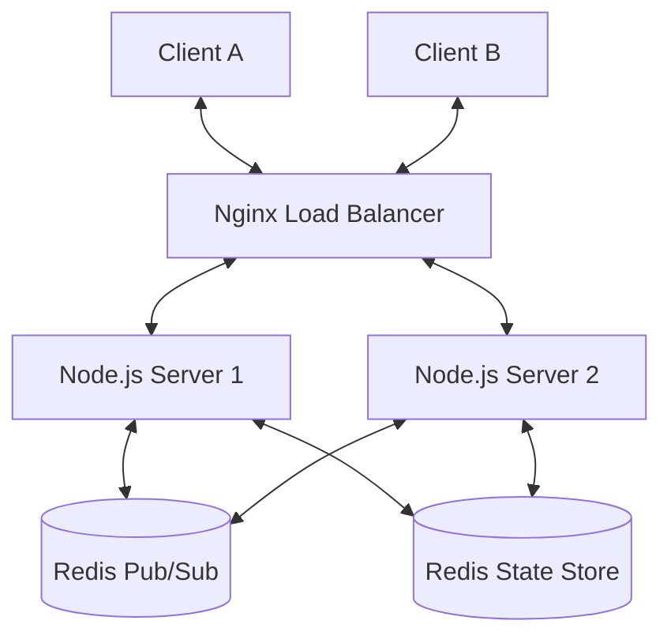

# ThinkBoard 🎨

**ThinkBoard** is a high-performance, real-time collaborative whiteboard designed to demonstrate core distributed systems concepts. Built as a mini-version of Miro/Figma, it focuses on seamless synchronization, horizontal scalability, and conflict resolution.

---

## 🚀 Problem
Traditional whiteboarding applications often struggle with:
- **Concurrency**: Multiple users editing the same object simultaneously.
- **Latency**: Significant delays in seeing other users' changes.
- **Scalability**: Difficulty handling thousands of concurrent rooms and users across multiple server instances.
- **State Consistency**: Ensuring every user eventually sees the exact same canvas (Eventual Consistency).

ThinkBoard addresses these by using **CRDTs (Conflict-free Replicated Data Types)** and a **Distributed Pub/Sub** architecture.

---

## 🏗️ Architecture

ThinkBoard follows a stateless backend design supported by a distributed messaging layer.



### Key Components:
- **Frontend**: Vanilla JS + Canvas API. Optimized for performance and low memory footprint.
- **Backend**: Node.js + WebSockets (`ws`).
- **Conflict Resolution**: Operation-based CRDTs with Lamport Timestamps and Vector Clocks.
- **Scaling**: Redis Pub/Sub for cross-instance communication and Nginx for session affinity (Sticky Sessions).
- **Presence**: Heartbeat-based system tracking cursor positions and active users.

---

## ⚖️ Tradeoffs

| Feature | Tradeoff | Rationale |
|---------|----------|-----------|
| **Consistency** | Eventual Consistency | Prioritizing availability and low latency over immediate global locking. |
| **Storage** | In-Memory (default) | Optimized for the user's i3 laptop constraints, with Redis fallback for scaling. |
| **State** | Operation Log | Storing a list of operations instead of just the final pixels allows for Undo/Redo and high-fidelity reconstruction. |

---

## 📈 Scaling Strategy

ThinkBoard is designed to scale horizontally:
1. **Stateless Servers**: Backend instances do not store long-term state.
2. **Sticky Sessions**: Nginx ensures a client's WebSocket remains connected to the same instance for the duration of the session.
3. **Redis Pub/Sub**: When a user draws on Server A, the operation is published to Redis. Server B, C, and D subscribe to these updates and push them to their locally connected clients.
4. **Room Partitioning**: State is partitioned by `RoomID` to prevent any single server or database from becoming a bottleneck.

---

## 🛠️ Local Setup

ThinkBoard is optimized for low-resource environments (i3 CPU, 12GB RAM).

### Option 1: Standard Node.js (Recommended for local dev)
1. Install dependencies:
   ```bash
   npm install
   ```
2. Start the server:
   ```bash
   npm start
   ```
3. Open `http://localhost:3000` in multiple tabs to test collaboration.

### Option 2: Docker Compose (Single Instance)
```bash
docker-compose up -d
```

### Option 3: Horizontal Scaling Demo (3 Instances + Redis)
```bash
docker-compose -f docker-compose.yml -f docker-compose.scale.yml up -d --scale app=3
```

---

## 🖼️ Screenshots

> [!TIP]
> Use the "Generate Room ID" button to quickly create a private space and share the URL with others!

### Join Screen


### Collaborative Canvas


---

## 🧠 Distributed Systems Concepts Demonstrated
- **WebSockets**: Bi-directional, full-duplex communication.
- **CRDT (Commutative Replicated Data Types)**: Deterministic conflict resolution.
- **Lamport Timestamps**: Total ordering of events in a distributed system.
- **Vector Clocks**: Tracking causality between events.
- **Pub/Sub Pattern**: Decoupling message senders from receivers.
- **Presence Tracking**: Real-time "liveness" detection.
